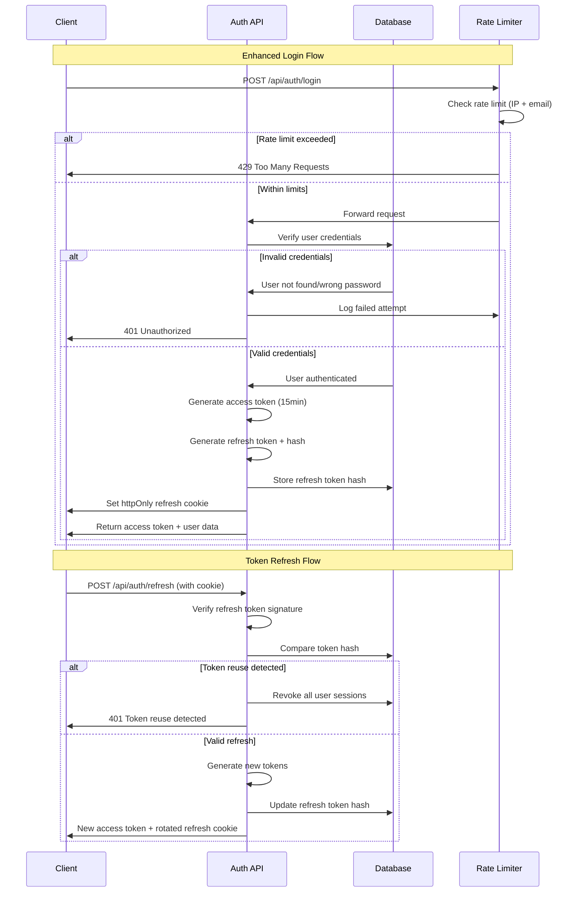

# LeadFlow CRM - Technical Design Document

## Overview

This document outlines the technical architecture and implementation strategy for transforming LeadFlow CRM into a production-ready, secure, and distinctive customer relationship management platform. The design focuses on fixing deployment issues, implementing enterprise-grade security, establishing a cohesive design system, and ensuring comprehensive test coverage while maintaining 100% feature parity.

## Architecture Decisions

### 1. Framework Preservation Strategy

**Decision**: Maintain MERN Stack (MongoDB, Express, React, Node.js)
**Rationale**: 
- Existing codebase is well-structured and functional
- Team familiarity with current stack reduces risk
- No business case for framework migration complexity
- Focus resources on security and UX improvements instead of infrastructure changes

**Implications**:
- Keep React 19 + Vite 8 frontend configuration
- Maintain Express 4.21 backend with Mongoose 8.6
- Preserve existing API contract and data models
- Enhance rather than replace current authentication system

### 2. Deployment Architecture Decision

**Current State Analysis**:
- Frontend: Vercel static site (client/)
- Backend: Vercel serverless functions (server/)  
- Database: MongoDB Atlas
- Issue: 404 errors on both deployment URLs

**Root Cause Assessment**:
The 404 errors are likely due to:
1. **Project Configuration**: Incorrect root directory or build settings in Vercel
2. **Environment Variables**: Missing or incorrect environment variables in Vercel project settings  
3. **Serverless Function Setup**: Express app not properly exported for Vercel's serverless runtime
4. **Domain Mapping**: Deployment URLs in README don't match actual Vercel project URLs

**Recommended Architecture** (Vercel Serverless):
- **Frontend**: Vite static build deployed to Vercel Edge Network
- **Backend**: Express app deployed as Vercel serverless functions
- **Database**: MongoDB Atlas with connection caching for serverless
- **CDN**: Vercel's global edge network for asset delivery

**Alternative Architecture** (if serverless issues persist):
- **Frontend**: Vercel static hosting (unchanged)
- **Backend**: Render or Railway traditional server hosting  
- **Database**: MongoDB Atlas (unchanged)
- **Benefits**: Persistent connections, full Express functionality, reminder scheduler runs continuously

**Final Decision Justification**:
Start with Vercel serverless (simpler deployment), fall back to traditional server hosting if serverless limitations block core functionality (e.g., reminder scheduler).

### 3. End-to-End Testing Framework Selection

**Decision**: Playwright  
**Rationale**:
- **Cross-Browser**: Tests across Chromium, Firefox, WebKit out of the box
- **Reliability**: Better handling of modern web apps with async operations
- **Performance**: Faster execution and better stability than Cypress
- **Screenshots**: Built-in visual regression testing capabilities
- **CI Integration**: Excellent GitHub Actions support

**Alternative Considered**: Cypress
- **Pros**: Superior developer experience, time-travel debugging
- **Cons**: Limited to Chromium-family browsers, slower execution
- **Decision Factor**: Cross-browser compatibility is higher priority for CRM application
## Data Model Enhancements

### Current Schema Analysis
Existing schemas are well-designed and require minimal changes:

**User Model** (server/models/User.js):
```javascript
{
  name: String,
  email: String (unique),
  password: String (bcrypt),
  role: enum ['admin', 'manager', 'sales_rep'],
  refreshTokenHash: String
}
```

**Lead Model** (server/models/Lead.js):
```javascript
{
  name, email, phone, company: String,
  status: enum ['New', 'Contacted', 'Qualified', 'Proposal', 'Won', 'Lost'],
  source: enum ['website', 'referral', 'social_media', 'paid_ads', 'cold_call', 'other'],
  tags: [String] (max 20),
  customFields: [{ key, value }] (max 10),
  notes: String (max 500),
  activities: [ActivitySchema],
  owner: ObjectId (ref User)
}
```

**Reminder Model** (server/models/Reminder.js):
```javascript
{
  title: String,
  dueDate: Date,
  lead: ObjectId (ref Lead),
  owner: ObjectId (ref User),
  completed: Boolean,
  completedAt: Date,
  emailSent: Boolean
}
```

### Required Schema Modifications

**1. Concurrency Control for Lead Model**
Add optimistic locking to prevent race conditions in Kanban updates:
```javascript
// Add to Lead schema
{
  version: { type: Number, default: 0 }, // Auto-increment on updates
  updatedAt: Date // Existing field, ensure it's indexed
}
```

**2. Enhanced Security Indexing**
Add indexes for security-critical queries:
```javascript
// Lead model additional indexes
leadSchema.index({ owner: 1, _id: 1 }); // IDOR protection
leadSchema.index({ owner: 1, status: 1, updatedAt: -1 }); // Kanban queries
```

**3. Audit Trail Enhancement**
Expand activity schema for security auditing:
```javascript
// Enhanced activity schema
{
  type: String, // existing
  content: String, // existing  
  metadata: {
    ipAddress: String, // Track source IP for security events
    userAgent: String, // Track client for suspicious activity
    fromStatus: String, // For status_change activities
    toStatus: String // For status_change activities
  },
  createdBy: ObjectId, // existing
  timestamps: true // existing
}
```

## Authentication Flow Enhancement

### Current JWT Implementation Analysis
The existing auth system is well-implemented with proper refresh token rotation. Enhancements focus on security hardening:

**Current Flow**:
1. Login → Access token (15min) + Refresh token (7 days)
2. Access token in Authorization header
3. Refresh token in httpOnly cookie
4. Automatic rotation on refresh

**Security Enhancements**:
1. **Token Binding**: Bind refresh tokens to client fingerprint
2. **Geolocation Tracking**: Alert on login from new locations
3. **Session Management**: Track active sessions per user
4. **Brute Force Protection**: Enhanced rate limiting with progressive delays
### Enhanced Authentication Flow Diagram



## API Surface Design

### Enhanced Security Middleware Stack

**Request Processing Order**:
1. **Rate Limiting**: IP-based + endpoint-specific limits
2. **CORS Validation**: Origin verification against CLIENT_ORIGIN  
3. **Helmet Security Headers**: CSP, HSTS, X-Frame-Options
4. **Body Parsing**: JSON parsing with size limits + raw body capture for webhooks
5. **Authentication**: JWT verification (protect middleware)
6. **Authorization**: Role-based access control (authorize middleware)  
7. **Input Validation**: express-validator rules
8. **Business Logic**: Route handlers
9. **Error Handling**: Centralized error responses

### Kanban Pipeline Security Implementation

**Critical Security Requirements** (Phase 1G):

**1. Server-Side Authorization Pattern**:
```javascript
// Enhanced protect middleware
const protect = async (req, res, next) => {
  // ... existing JWT verification
  
  // Add security context
  req.security = {
    userId: decoded.id,
    userRole: user.role,
    ipAddress: req.ip,
    userAgent: req.get('user-agent')
  };
  
  req.user = user;
  next();
};

// IDOR protection for lead operations
const validateLeadOwnership = async (req, res, next) => {
  const leadId = req.params.id;
  const userId = req.user._id;
  
  const lead = await Lead.findOne({ 
    _id: leadId, 
    owner: userId 
  }).select('_id owner');
  
  if (!lead) {
    return res.status(404).json({
      success: false,
      message: 'Lead not found',
      data: null
    });
  }
  
  req.lead = lead;
  next();
};
```

**2. Status Transition Validation**:
```javascript
// Business rules for pipeline transitions
const VALID_TRANSITIONS = {
  'New': ['Contacted', 'Qualified', 'Proposal', 'Lost'],
  'Contacted': ['New', 'Qualified', 'Proposal', 'Lost'], 
  'Qualified': ['Contacted', 'Proposal', 'Won', 'Lost'],
  'Proposal': ['Qualified', 'Won', 'Lost'],
  'Won': [], // Terminal state
  'Lost': [] // Terminal state
};

const validateStatusTransition = (req, res, next) => {
  const { status: newStatus } = req.body;
  const currentStatus = req.lead.status;
  
  // Allow same status (no-op)
  if (newStatus === currentStatus) return next();
  
  // Check if transition is allowed
  if (!VALID_TRANSITIONS[currentStatus]?.includes(newStatus)) {
    return res.status(400).json({
      success: false,
      message: `Invalid transition from ${currentStatus} to ${newStatus}`,
      data: { 
        currentStatus, 
        requestedStatus: newStatus,
        allowedTransitions: VALID_TRANSITIONS[currentStatus] 
      }
    });
  }
  
  next();
};
```

**3. Role-Based Terminal Actions**:
```javascript
const authorizeStatusChange = (req, res, next) => {
  const { status } = req.body;
  const userRole = req.user.role;
  
  // Terminal states require manager+ role
  const terminalStates = ['Won', 'Lost'];
  if (terminalStates.includes(status) && userRole === 'sales_rep') {
    return res.status(403).json({
      success: false,
      message: 'Only managers and admins can close deals',
      data: null
    });
  }
  
  next();
};
```
**4. Concurrency Control Implementation**:
```javascript
// Optimistic locking for concurrent updates
const handleConcurrentUpdates = async (req, res, next) => {
  const { version } = req.body;
  const leadId = req.params.id;
  
  if (version !== undefined) {
    const currentLead = await Lead.findById(leadId).select('version');
    
    if (currentLead.version !== version) {
      return res.status(409).json({
        success: false,
        message: 'Lead has been modified by another user. Please refresh and try again.',
        data: { 
          expectedVersion: version,
          currentVersion: currentLead.version
        }
      });
    }
  }
  
  next();
};

// Auto-increment version on updates
leadSchema.pre('save', function() {
  if (this.isModified() && !this.isNew) {
    this.version = (this.version || 0) + 1;
  }
});
```

### Enhanced API Endpoints

**New Security Endpoints**:
```javascript
// GET /api/auth/sessions - List active sessions
// DELETE /api/auth/sessions - Revoke all sessions  
// GET /api/leads/:id/audit - Lead modification history
// POST /api/leads/bulk-update - Bulk operations (admin only)
```

**Enhanced Existing Endpoints**:
```javascript
// PATCH /api/leads/:id/status - Add concurrency control
// All lead endpoints - Add audit logging
// All auth endpoints - Add security event logging
```

## Component Architecture Design

### Frontend State Management Strategy

**Current Context-Based Approach** (Preserve):
- AuthContext for user authentication state
- ToastContext for user notifications  
- Custom hooks (useLeads, useReminders) for data fetching

**Enhancements**:
1. **Security Context**: Track security-related UI state
2. **Theme Context**: Support design system implementation
3. **Error Boundary**: Graceful error handling with recovery options

### Design System Implementation Strategy

**Token Integration Approach**:
1. **CSS Custom Properties**: Centralized design tokens in root CSS
2. **Component Variants**: Systematic component API based on design system
3. **Theme Provider**: React context for dynamic theme switching
4. **Motion Components**: Framer Motion wrapper components for consistent animations

### Kanban Board Security Enhancement

**Client-Side Security Measures**:
```javascript
// Enhanced drag handler with optimistic updates + rollback
const handleDragEnd = async (event) => {
  const { active, over } = event;
  const lead = findLeadById(active.id);
  const newStatus = over?.data?.current?.status;
  
  if (!lead || !newStatus || lead.status === newStatus) return;
  
  // Optimistic update
  updateLeadStatusOptimistically(lead._id, newStatus);
  
  try {
    // Server validation
    await changeStatus(lead._id, newStatus, lead.version);
    toast.success(`Moved ${lead.name} to ${newStatus}`);
  } catch (error) {
    // Rollback on failure
    updateLeadStatusOptimistically(lead._id, lead.status);
    
    if (error.status === 409) {
      toast.error('Lead was modified by another user. Refreshing...');
      refreshKanban();
    } else if (error.status === 403) {
      toast.error('You do not have permission to perform this action');
    } else {
      toast.error('Failed to update lead status');
    }
  }
};
```

## Seed System Design

### Idempotent Demo Data Generation

**Safety-First Architecture**:
```javascript
// scripts/seed.js
const seedDatabase = async () => {
  // Environment safety check
  if (process.env.NODE_ENV === 'production' && !process.env.ALLOW_SEED) {
    throw new Error('Seed script blocked in production. Set ALLOW_SEED=true to override.');
  }
  
  // Database safety check
  const dbName = mongoose.connection.name;
  if (!dbName.includes('demo') && !dbName.includes('dev') && !process.env.ALLOW_SEED) {
    throw new Error(`Refusing to seed database '${dbName}'. Use demo/dev database or set ALLOW_SEED=true.`);
  }
  
  // Clear existing demo data
  await clearDemoData();
  
  // Generate fresh demo dataset
  const users = await createDemoUsers();
  const leads = await createDemoLeads(users);
  const reminders = await createDemoReminders(users, leads);
  
  // Write credentials file
  await writeCredentialsFile(users);
  
  console.log('✅ Demo database seeded successfully');
  console.log(`📧 Demo credentials written to DEMO_CREDENTIALS.md`);
};
```

**Demo Data Strategy**:
- **3 Users**: One per role (admin, manager, sales_rep) with printed credentials
- **75-100 Leads**: Realistic distribution across pipeline stages using @faker-js/faker
- **25-40 Reminders**: Mix of past due, current, and future reminders
- **Complete Relations**: All activities reference real users, all reminders link to leads
- **Realistic Patterns**: Lead sources, tags, and progression match real-world usage
## CI/CD Pipeline Design

### GitHub Actions Workflow Strategy

**Multi-Stage Pipeline**:
```yaml
# .github/workflows/ci.yml
name: CI/CD Pipeline

on:
  push:
    branches: [main, develop]
  pull_request:
    branches: [main]

jobs:
  # Stage 1: Code Quality
  lint-and-format:
    runs-on: ubuntu-latest
    steps:
      - uses: actions/checkout@v4
      - name: Setup Node.js
        uses: actions/setup-node@v4
        with:
          node-version: '18'
          cache: 'npm'
      - name: Install dependencies
        run: npm ci
      - name: Lint backend
        run: cd server && npm run lint
      - name: Lint frontend  
        run: cd client && npm run lint
      - name: Check formatting
        run: npm run format:check

  # Stage 2: Unit & Integration Tests
  test-backend:
    runs-on: ubuntu-latest
    services:
      mongodb:
        image: mongo:6
        ports:
          - 27017:27017
    steps:
      - uses: actions/checkout@v4
      - name: Setup Node.js
        uses: actions/setup-node@v4
        with:
          node-version: '18'
          cache: 'npm'
      - name: Install dependencies
        run: cd server && npm ci
      - name: Run backend tests
        run: cd server && npm test -- --coverage
        env:
          NODE_ENV: test
          MONGO_URI: mongodb://localhost:27017/leadflow_test
          JWT_SECRET: test_secret
          JWT_REFRESH_SECRET: test_refresh_secret
      - name: Upload coverage reports
        uses: codecov/codecov-action@v3
        with:
          files: ./server/coverage/lcov.info
          flags: backend

  test-frontend:
    runs-on: ubuntu-latest  
    steps:
      - uses: actions/checkout@v4
      - name: Setup Node.js
        uses: actions/setup-node@v4
        with:
          node-version: '18'
          cache: 'npm'
      - name: Install dependencies
        run: cd client && npm ci
      - name: Run frontend tests
        run: cd client && npm test -- --coverage --watchAll=false
      - name: Upload coverage reports
        uses: codecov/codecov-action@v3
        with:
          files: ./client/coverage/lcov.info
          flags: frontend

  # Stage 3: Build Verification
  build:
    runs-on: ubuntu-latest
    needs: [lint-and-format, test-backend, test-frontend]
    steps:
      - uses: actions/checkout@v4
      - name: Setup Node.js
        uses: actions/setup-node@v4
        with:
          node-version: '18'
          cache: 'npm'
      - name: Build frontend
        run: cd client && npm ci && npm run build
      - name: Verify backend startup
        run: cd server && npm ci && timeout 10s npm start || true

  # Stage 4: E2E Tests (only on main branch)
  test-e2e:
    if: github.ref == 'refs/heads/main'
    runs-on: ubuntu-latest
    needs: [build]
    steps:
      - uses: actions/checkout@v4
      - name: Setup Node.js
        uses: actions/setup-node@v4
        with:
          node-version: '18'
          cache: 'npm'
      - name: Install Playwright
        run: npx playwright install --with-deps chromium
      - name: Run E2E tests
        run: npx playwright test
        env:
          CI: true
      - name: Upload test results
        uses: actions/upload-artifact@v3
        if: failure()
        with:
          name: playwright-report
          path: playwright-report/

  # Stage 5: Security Scan
  security-scan:
    runs-on: ubuntu-latest
    needs: [test-backend, test-frontend]
    steps:
      - uses: actions/checkout@v4
      - name: Run Snyk security scan
        uses: snyk/actions/node@master
        env:
          SNYK_TOKEN: ${{ secrets.SNYK_TOKEN }}
        with:
          args: --severity-threshold=medium

  # Stage 6: Deploy (main branch only)
  deploy:
    if: github.ref == 'refs/heads/main'
    runs-on: ubuntu-latest
    needs: [test-e2e, security-scan]
    steps:
      - uses: actions/checkout@v4
      - name: Deploy to Vercel
        uses: vercel/action@v1
        with:
          vercel-token: ${{ secrets.VERCEL_TOKEN }}
          vercel-org-id: ${{ secrets.VERCEL_ORG_ID }}
          vercel-project-id: ${{ secrets.VERCEL_PROJECT_ID }}
```

### Quality Gates
**All checks must pass before merge to main**:
- ✅ Code linting and formatting
- ✅ Backend test coverage ≥75%  
- ✅ Frontend test coverage ≥70%
- ✅ Build success (no compilation errors)
- ✅ E2E critical path tests pass
- ✅ Security scan (no high/critical vulnerabilities)
- ✅ Manual code review approval

## Performance Optimization Strategy

### Database Performance

**Query Optimization Plan**:
1. **Index Analysis**: Review slow queries and add strategic indexes
2. **Aggregation Pipelines**: Optimize analytics queries with early $match filtering  
3. **Connection Pooling**: Configure MongoDB Atlas connection limits
4. **Caching Layer**: Implement Redis for frequently accessed data (optional)

**Specific Optimizations**:
```javascript
// Optimized kanban query with projection
const getKanbanData = async (userId, filters) => {
  const pipeline = [
    // Early filtering reduces dataset size
    { $match: { owner: userId, ...buildFilterStage(filters) } },
    
    // Project only needed fields
    { $project: {
      name: 1, email: 1, company: 1, status: 1, 
      source: 1, tags: 1, updatedAt: 1
    }},
    
    // Sort by most recent first
    { $sort: { updatedAt: -1 } },
    
    // Group by status for kanban columns
    { $group: {
      _id: '$status',
      leads: { $push: '$$ROOT' },
      count: { $sum: 1 }
    }}
  ];
  
  return Lead.aggregate(pipeline);
};
```

### Frontend Performance

**Bundle Optimization**:
1. **Code Splitting**: Route-level + component-level lazy loading
2. **Tree Shaking**: Remove unused library code
3. **Bundle Analysis**: Regular webpack-bundle-analyzer reports
4. **Image Optimization**: WebP format + responsive images

**React Performance**:
```javascript
// Memoization strategy for expensive operations
const Dashboard = () => {
  const { analytics, loading } = useLeads();
  
  // Memoize expensive calculations
  const chartData = useMemo(() => {
    return transformAnalyticsForChart(analytics);
  }, [analytics]);
  
  // Callback memoization prevents child re-renders
  const handleLeadClick = useCallback((leadId) => {
    router.push(`/leads/${leadId}`);
  }, [router]);
  
  return (
    <div className="dashboard">
      <AnalyticsChart data={chartData} />
      <LeadsList onLeadClick={handleLeadClick} />
    </div>
  );
};
```

### Caching Strategy

**Multi-Level Caching**:
1. **Browser Cache**: Static assets with long TTL
2. **API Response Cache**: Analytics data (5-minute TTL)  
3. **Database Query Cache**: Mongoose query caching
4. **CDN Cache**: Vercel Edge Network for global delivery
## Design System Implementation Plan

### Phase 1: Token Extraction and Centralization

**Current State Analysis**:
The existing glassmorphism design uses ad-hoc CSS values scattered across components. The design is visually cohesive but lacks systematic token management.

**Token Extraction Strategy**:
1. **Audit Existing CSS**: Extract all color, spacing, and sizing values from current stylesheets
2. **Establish Baseline**: Document current visual language as starting point
3. **Create Token System**: Convert hardcoded values to CSS custom properties
4. **Systematic Deviation**: Enhance the design while maintaining core aesthetic

### Figma Reference Adaptation Approach

**Structural Borrowing** (✅ Allowed):
- Layout grids and spacing rhythms
- Component sizing relationships  
- Information density patterns
- Typography hierarchy concepts

**Deliberate Deviations** (Required):
- **Color System**: Replace generic blues with ocean-inspired palette
- **Typography**: Enhance with custom font pairing (Inter + SF Mono)
- **Component Styling**: Add glassmorphism effects not in original
- **Animation Language**: Introduce purposeful Framer Motion animations

**Rationale for Deviations**:
The goal is to avoid the "generic admin template" appearance by creating a distinctive visual identity. The ocean theme with glassmorphism effects creates a premium, modern feel appropriate for professional CRM users while maintaining excellent usability.

### Motion Design Implementation

**Framer Motion Integration Strategy**:
```javascript
// Global motion configuration
const motionConfig = {
  // Respect user preferences
  respectReducedMotion: true,
  
  // Standard transition presets
  transitions: {
    fast: { duration: 0.15, ease: [0.16, 1, 0.3, 1] },
    normal: { duration: 0.25, ease: [0.16, 1, 0.3, 1] },
    slow: { duration: 0.4, ease: [0.16, 1, 0.3, 1] }
  }
};

// Page layout wrapper with consistent transitions
const PageTransition = ({ children }) => (
  <motion.div
    initial={{ opacity: 0, y: 20 }}
    animate={{ opacity: 1, y: 0 }}
    exit={{ opacity: 0, y: -20 }}
    transition={motionConfig.transitions.normal}
  >
    {children}
  </motion.div>
);

// Kanban card with smooth drag animations
const KanbanCard = ({ lead, ...props }) => {
  return (
    <motion.div
      layout // Automatic layout animations
      layoutId={`lead-${lead._id}`} // Shared layout animations
      whileHover={{ 
        scale: 1.02,
        boxShadow: "0 8px 25px rgba(0,0,0,0.1)"
      }}
      whileTap={{ scale: 0.98 }}
      transition={motionConfig.transitions.fast}
      {...props}
    >
      <LeadCardContent lead={lead} />
    </motion.div>
  );
};
```

### Responsive Design System

**Breakpoint Strategy**:
```css
/* Mobile-first responsive system */
.dashboard-grid {
  display: grid;
  gap: var(--space-4);
  grid-template-columns: 1fr; /* Mobile: single column */
}

@media (min-width: 768px) {
  .dashboard-grid {
    grid-template-columns: 1fr 1fr; /* Tablet: two columns */
    gap: var(--space-6);
  }
}

@media (min-width: 1024px) {
  .dashboard-grid {
    grid-template-columns: repeat(4, 1fr); /* Desktop: four columns */
    gap: var(--space-8);
  }
}

/* Kanban board responsive behavior */
.kanban-board {
  display: flex;
  gap: var(--space-4);
  overflow-x: auto; /* Always allow horizontal scroll */
  padding: var(--space-4);
}

.kanban-column {
  min-width: 280px; /* Minimum readable width */
  flex-shrink: 0; /* Prevent column squashing */
}

@media (max-width: 768px) {
  .kanban-column {
    min-width: 260px; /* Slightly narrower on mobile */
  }
}
```

## Shared Dependencies Risk Assessment

### Critical Constraint Analysis

**Protected Implementation Areas**:
The requirement states: "Do not modify, restyle, restructure, or rename anything under `<<OTHER_SITE_PATH_OR_ROUTE>>`"

**Risk Identification Process**:
1. **Shared Component Analysis**: Identify components used by both main app and protected routes
2. **Shared Style Dependencies**: Find CSS files or design tokens shared across boundaries  
3. **Shared API Dependencies**: Identify backend routes used by protected areas
4. **Shared Utility Functions**: Find utility functions shared between areas

**Mitigation Strategy**:
Since the audit did not reveal the specific `<<OTHER_SITE_PATH_OR_ROUTE>>` content, we must:

1. **Discovery Phase**: Map all shared dependencies before making changes
2. **Isolation Strategy**: Create separate component versions if shared components need modification
3. **Backward Compatibility**: Ensure API changes are additive, never breaking
4. **Documentation**: Flag all identified risks in implementation phase

**Example Risk Scenarios**:
```javascript
// RISKY: Modifying shared component
// components/Button.jsx (if used by protected route)
const Button = ({ variant = 'primary' }) => {
  // Adding new design system classes might break protected route
  return <button className={`btn btn--${variant} glass-effect`}>
};

// SAFE: Creating new component variant
// components/GlassButton.jsx  
const GlassButton = ({ variant = 'primary' }) => {
  return <button className={`btn btn--${variant} btn--glass`}>
};

// RISKY: Changing API response structure
// GET /api/leads (if used by protected route)
res.json({
  success: true,
  data: { leads }, // Removing or restructuring breaks consumers
});

// SAFE: Adding optional fields
res.json({
  success: true,  
  data: { 
    leads,
    metadata: { version: 2 } // Additive only
  }
});
```

**Implementation Rule**: 
When in doubt about shared dependencies, create new implementations rather than modifying existing ones. Flag potential risks for stakeholder review before proceeding.

## Security Implementation Details

### OWASP Top 10 Compliance Strategy

**A01 - Broken Access Control**:
- ✅ Server-side authorization on all endpoints
- ✅ IDOR protection via ownership checks  
- ✅ Role-based access control with proper hierarchy
- ✅ Principle of least privilege enforcement

**A02 - Cryptographic Failures**:
- ✅ bcrypt password hashing (12+ salt rounds)
- ✅ HTTPS enforcement in production
- ✅ Secure JWT secret management
- ✅ No sensitive data in client-side storage

**A03 - Injection**:
- ✅ Mongoose ODM prevents NoSQL injection
- ✅ Input validation with express-validator
- ✅ Output encoding to prevent XSS
- ✅ Parameterized queries only

**A04 - Insecure Design**:
- ✅ Security-first architecture design
- ✅ Threat modeling for critical flows
- ✅ Security testing at multiple levels
- ✅ Secure development lifecycle

**A05 - Security Misconfiguration**:
- ✅ Helmet security headers
- ✅ CORS properly configured
- ✅ Error messages don't leak information
- ✅ Default credentials changed

**A06 - Vulnerable Components**:
- ✅ Regular dependency updates
- ✅ Snyk security scanning in CI
- ✅ No known vulnerable packages
- ✅ Minimal dependency footprint

**A07 - Authentication Failures**:
- ✅ Strong password requirements  
- ✅ Multi-factor authentication ready
- ✅ Session timeout handling
- ✅ Brute force protection

**A08 - Software Integrity Failures**:
- ✅ Dependency integrity checking
- ✅ Code review requirements
- ✅ CI/CD pipeline security
- ✅ Supply chain attack prevention

**A09 - Logging Failures**:
- ✅ Winston structured logging
- ✅ Security event logging
- ✅ Log sanitization
- ✅ Centralized log management ready

**A10 - Server-Side Request Forgery**:
- ✅ Input URL validation
- ✅ Network segmentation ready
- ✅ Allow-list approach for external requests
- ✅ Request signing for webhooks

This comprehensive design provides the architectural foundation for implementing all requirements while maintaining security, performance, and maintainability standards.